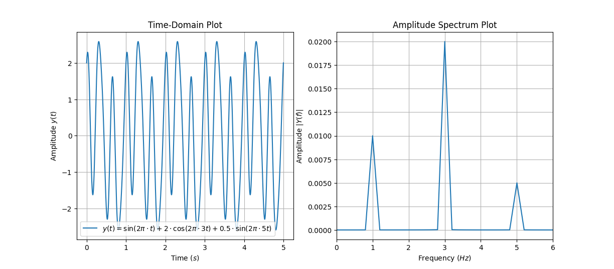

# Algorithms to Compute the Discrete Fourier Transform (DFT)

## Continuous Time Fourier Transform
_"In mathematics, the Fourier transform (FT) is an integral transform that takes a function as input then outputs
 another function that describes the extent to which various frequencies are present in the original function. The output of the transform is a complex-valued function of frequency."_ (See https://en.wikipedia.org/wiki/Fourier_transform)

The Continuous Time Fourier Transform (CTFT) is defined as:
$$
\boxed{
F(\omega) = \int_{-\infty}^{\infty}f(t)e^{-j\omega t}dt,\quad\forall\omega \in \R
}
$$
Following this, the Inverse Continuous Fourier Transform (ICFT) is given by:
$$
\boxed{
f(t) = \frac{1}{2\pi}\int_{-\infty}^{\infty}F(\omega)e^{j\omega t}d\omega,\quad\forall\ t \in \R
}
$$
Where:
$$
\omega = 2\pi f
$$

## Discrete Time Fourier Transform
From the continuous Fourier transform, we will now derieve the Discrete Time Fourier Transform (DTFT).

Consider the following sampling signal (impulse train) which samples every $T$ seconds:
$$s(t) = \sum_{n=-\infty}^{\infty}\delta(t-nT)$$
This signal will be used to sample $x(t)$ which gives:
$$
x_s(t) = s(t)\cdot x(t) = \sum_{n=-\infty}^{\infty}\delta(t-nT)\cdot x(t) = \sum_{n=-\infty}^{\infty}\delta(t-nT)\cdot x(nT)
$$
Taking the Fourier Transform of $x_s(t)$ gives:
$$
\begin{align}
\notag X_s(f) = \mathcal{F}\{x_s(t)\} &= \int_{-\infty}^{\infty}x_s(t)\cdot e^{-j2\pi ft}dt\\
\notag &=\int_{-\infty}^{\infty}\left[\sum_{n=-\infty}^{\infty}\delta(t-nT)\cdot x(nT)\right]\cdot e^{-j2\pi f t}dt\\
\notag &=\sum_{n=-\infty}^{\infty}\left[x(nT)\int_{-\infty}^{\infty}\delta(t-nT)\cdot e^{-j2\pi f t}dt\right]\\
\notag &=\sum_{n=-\infty}^{\infty}x(nT)\cdot e^{-j2\pi fnT}\quad\text{(by the shifting property)}\\
\notag &=\sum_{n=-\infty}^{\infty}x(nT)\cdot e^{-j2\pi f_\omega n},\quad\text{where }f_\omega = fT = \frac{f}{f_s}
\end{align}
$$
Subbing $\omega = 2\pi f_\omega$ gives:
$$
\boxed{X(\omega)=\sum_{n=-\infty}^{\infty}x(nT)\cdot e^{-jn\omega}}
$$

To derive the Inverse Discrete Time Fourier Transform (IDTFT), we consider the window of the samples signal.
$$

$$

## Example
For instance, here's a simulation/plot done in python:

It can be seen that the transforms decomposes the input signal into its frequency components simplifying analysis and processing in the frequency domain.

The Fourier transform is an integral transformation which takes signals in their original domain and maps it to its constituent frequencies.

The continuous/analogue